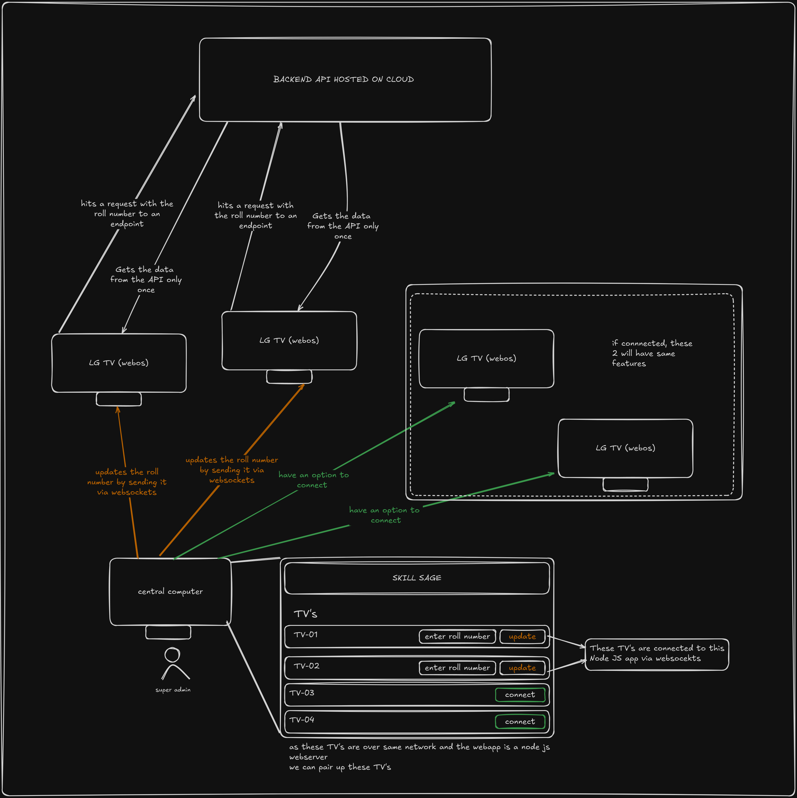

# WebOS Placement Interview Application

## Overview
This project is a WebOS application designed for LG Smart TVs, specifically to assist recruiters during college placement interviews. The application displays student biodata, performance metrics, and project details on a TV in each interview room. Recruiters can navigate through the app using the LG Magic Remote, making the candidate evaluation process more efficient.

## Architecture
The application follows a client-server model with WebSocket communication for real-time updates.

### Components:
- **Admin (Central Computer):** Runs a Node.js application with a WebSocket server.
- **LG WebOS TVs:** Hosted web app that connects to the WebSocket server.
- **WebSocket Communication:** Enables real-time interaction between the admin and TVs.
- **Backend API:** Serves student data upon request.

### Workflow:
1. Each TV is placed in a recruiter's interview room.
2. The TV app connects to the WebSocket server and registers itself as a client.
3. The admin assigns a student roll number to a specific TV.
4. The TV fetches the student's details via an API request and displays them in real-time.
5. The recruiter navigates through the app using the LG Magic Remote.

### Architecture Diagram


## Project Structure
```
client/                # React frontend application
server/                # Node.js backend server
web/                   # WebOS hosted web app configuration
├── appinfo.json       # WebOS application metadata
├── icons/             # Application icons
├── index.html         # Entry point for the hosted web app

docker-compose.yml      # Docker configuration for development
docker-compose.ec2.yml  # Docker configuration for EC2 deployment
```

## Setup and Installation

### Clone the repository:
```sh
git clone https://github.com/your-repo/webos-application.git
cd webos-application
```

### Install dependencies:
```sh
cd client && npm install
cd ../server && npm install
```

### Start the development environment:
```sh
docker-compose up
```

## WebOS TV Deployment
To deploy the application to an LG WebOS TV:

1. **Package the web app:**
   ```sh
   cd web
   zip -r webos-app.zip *
   ```
2. **Install on a WebOS device:**
   Use the LG WebOS Developer tool to install the package.
3. **Launch the application** from the TV menu.

## Development
This application uses Docker for consistent development environments. Run the following command to start all services locally:
```sh
docker-compose up
```

## License
This project is licensed under the MIT License.

